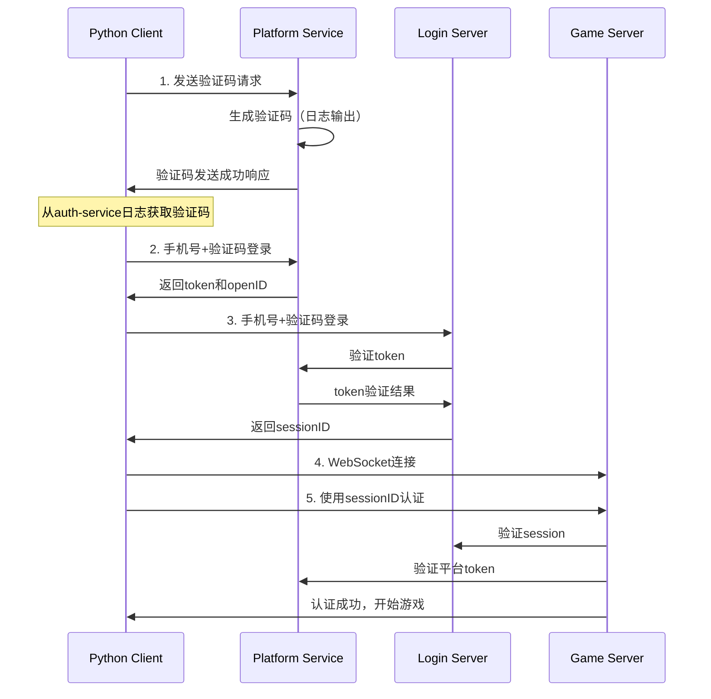
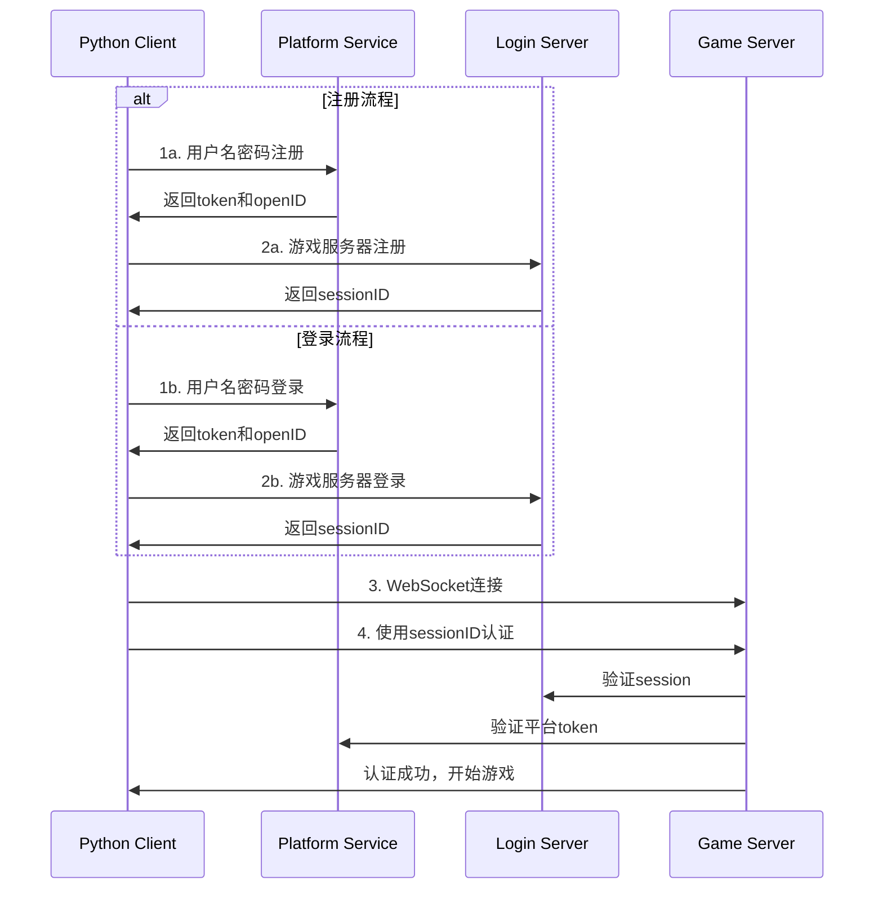

# 手机号注册登录Python客户端

## 概述

这些Python客户端实现了完整的手机号验证码和用户名密码登录流程，与平台认证服务和游戏服务器集成。

## 文件说明

### 新增的认证客户端

1. **phone_auth_client.py** - 手机号验证码登录客户端
   - 实现完整的手机号验证码登录流程
   - 支持与平台服务的认证集成
   - 连接游戏服务器并进行后续游戏操作

2. **username_auth_client.py** - 用户名密码登录客户端
   - 支持用户注册和登录
   - 与平台服务进行认证
   - 连接游戏服务器并进行游戏操作

### 原有文件

- **test_client.py** - 原始的简单测试客户端
- **protobuf_client_example.py** - 完整的客户端示例
- **client11.py** - 桌面宠物客户端

## 完整认证流程

### 手机号验证码登录流程



### 用户名密码登录流程



## 使用方法

### 1. 安装依赖

```bash
pip install websockets protobuf requests
```

### 2. 启动服务

确保以下服务已启动：
- 平台服务（API网关：8080端口）
- 认证服务（auth-service）
- 登录服务（8081端口）
- 游戏服务器（WebSocket：18080端口）

### 3. 运行手机号验证码登录客户端

```bash
cd client
python phone_auth_client.py
```

运行后按提示操作：
1. 输入国家代码（如 +86）
2. 输入手机号
3. 查看auth-service的日志获取验证码
4. 输入验证码
5. 自动完成登录和游戏连接

### 4. 运行用户名密码登录客户端

```bash
cd client
python username_auth_client.py
```

运行后按提示操作：
1. 选择注册（1）或登录（2）
2. 输入用户名、密码（注册时还需要邮箱）
3. 自动完成登录和游戏连接

## 技术特点

### 1. 双重认证机制
- 平台层认证：获取token和openID
- 游戏层认证：获取sessionID并验证

### 2. 完整的错误处理
- HTTP请求错误处理
- WebSocket连接错误处理
- Protobuf消息解析错误处理

### 3. 安全的会话管理
- 使用session ID进行游戏服务器认证
- 平台token与游戏session的关联验证

### 4. 灵活的服务配置
- 可配置的服务地址
- 支持不同的app_id和device_id

## 服务地址配置

默认配置：
- 平台服务（API网关）：`http://localhost:8080`
- 登录服务：`http://localhost:8081`
- 游戏服务器WebSocket：`ws://127.0.0.1:18080/ws`

如需修改，请编辑客户端代码中的相应配置。

## 验证码获取

手机号登录时，验证码会输出到auth-service的日志中，格式类似：
```
2025-09-13T10:36:42+08:00 level=INFO msg="向手机号 +8613812345678 发送验证码: 123456"
```

在测试环境中，请从日志中复制验证码并输入到客户端。

## 游戏操作

认证成功后，客户端支持以下游戏操作：
- 获取用户信息
- 抽卡操作
- 查看背包
- 其他游戏功能

## 故障排除

### 连接问题
1. 确认所有服务都已启动
2. 检查端口是否被占用
3. 验证防火墙设置

### 认证问题
1. 检查验证码是否正确
2. 确认用户名密码是否正确
3. 查看服务器日志获取详细错误信息

### WebSocket连接问题
1. 确认游戏服务器已启动
2. 检查WebSocket端口（18080）
3. 验证sessionID是否有效

## 开发说明

这些客户端基于以下技术：
- Python 3.7+
- WebSockets for real-time communication
- Protocol Buffers for message serialization
- Requests for HTTP API calls

客户端代码模块化设计，易于扩展和维护。

## 下一步

1. 添加更多游戏功能测试
2. 实现自动重连机制
3. 添加GUI界面
4. 支持更多认证方式