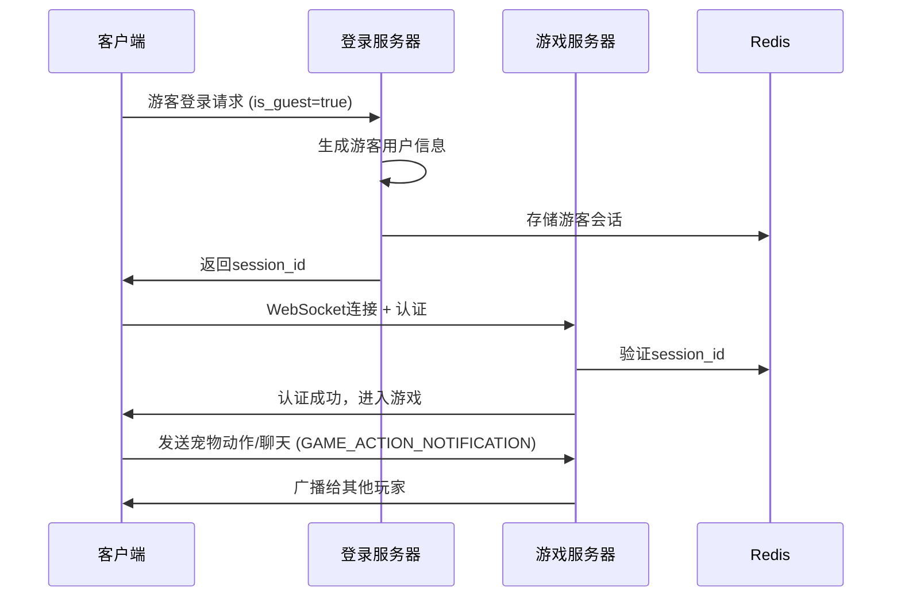

# 桌面宠物游客登录功能完整指南

## 项目概述

本项目在原有的 `client11.py` 基础上添加了**游客登录功能**，让用户可以快速体验桌面宠物的多人在线互动功能，包括实时聊天和动作同步。

## 🎯 主要功能

### ✨ 游客登录
- **一键登录**：无需手机号验证码，点击即可登录
- **自动分配**：系统自动分配游客用户名和OpenID
- **完整体验**：享受与正式用户相同的功能

### 👥 多人互动
- **实时同步**：看到其他在线玩家的桌面宠物
- **动作同步**：鼠标移动、点击等动作实时同步
- **位置共享**：宠物位置变化实时显示给其他玩家

### 💬 聊天系统
- **实时聊天**：在宠物底部输入框发送消息
- **聊天气泡**：消息以气泡形式显示在宠物旁边
- **多人聊天室**：支持多个玩家同时聊天

### 🎮 交互操作
- **拖拽移动**：鼠标左键拖拽移动宠物
- **右键菜单**：右键显示功能菜单
- **快捷聊天**：底部输入框 + 回车发送
- **动作触发**：鼠标和键盘操作触发动画

## 📁 新增文件

```
client/
├── client11.py                    # 修改后的主程序（新增游客登录）
├── desktop_pet_guest.py          # 专门的游客登录启动器
├── test_guest_login.py           # 功能测试脚本
├── start_desktop_pet.bat         # Windows启动脚本
├── start_desktop_pet.sh          # Linux/macOS启动脚本
└── DESKTOP_PET_GUEST_README.md   # 详细功能说明
```

## 🚀 快速开始

### 方法一：使用专用启动器（推荐）

**Windows:**
```bash
# 方式1：双击批处理文件
start_desktop_pet.bat

# 方式2：命令行启动
cd client
python desktop_pet_guest.py
```

**Linux/macOS:**
```bash
# 方式1：运行Shell脚本
chmod +x start_desktop_pet.sh
./start_desktop_pet.sh

# 方式2：直接运行Python
cd client
python3 desktop_pet_guest.py
```

### 方法二：使用原程序
```bash
cd client
python client11.py
```
然后在主页界面选择"游客登录"按钮。

## ⚙️ 环境准备

### 1. Python环境
- Python 3.7+ 
- 必要模块：`websockets`, `requests`, `pillow`, `pynput`

```bash
pip install websockets requests pillow pynput
```

### 2. 服务器环境
确保以下服务正在运行：

**登录服务器** (端口 8081)
```bash
cd server
go run src/servers/login/loginserver.go
```

**游戏服务器** (端口 18080)  
```bash
cd server
go run src/servers/game/*.go
```

**Redis服务器** (端口 6379)
```bash
redis-server
```

### 3. 测试环境
运行测试脚本检查环境：
```bash
cd client
python test_guest_login.py
```

## 🔧 技术实现

### 核心修改点

#### 1. AuthManager类增强
```python
class AuthManager:
    def __init__(self):
        self.device_id = str(uuid.uuid4())[:16]  # 设备ID
        self.is_guest = False                    # 游客标识
        
    def guest_login(self):
        """游客登录实现"""
        # 向登录服务器发送游客登录请求
        # 返回session_id用作token
```

#### 2. 统一登录接口
登录服务器支持统一的 `/login` 接口：
```json
{
  "device_id": "device_abc123",
  "app_id": "desktop_app", 
  "is_guest": true
}
```

#### 3. WebSocket纯Protobuf协议
服务器只接受protobuf格式的消息，所有消息都必须按照以下格式：
- **4字节长度头** + **protobuf消息体**
- 消息体必须是 `game.Message` 格式
- 桌面宠物同步通过 `GAME_ACTION_NOTIFICATION` 消息ID实现
- 消息数据中包含JSON格式的动作/聊天信息

```python
# 正确的消息发送方式
action_data = {
    "type": "pet_move",
    "player_id": "12345",
    "position_x": 100,
    "position_y": 200
}

# 转换为bytes并通过protobuf Message发送
action_bytes = json.dumps(action_data).encode('utf-8')
await client.protobuf_client.send_raw_message(
    game_pb.MessageId.GAME_ACTION_NOTIFICATION, 
    action_bytes
)
```

#### 4. 多玩家管理
- 玩家加入/离开通知
- 动作和聊天实时广播
- 位置信息同步

### 游客登录流程



## 📋 使用说明

### 基本操作

1. **启动程序**
   - 运行启动脚本或直接运行Python文件
   - 选择"游客登录"快速进入

2. **移动宠物**
   - 鼠标左键拖拽宠物到任意位置
   - 移动会同步给其他在线玩家

3. **发送聊天**
   - 在宠物底部输入框输入文字
   - 按回车键发送给所有人

4. **查看菜单**
   - 右键点击宠物显示功能菜单
   - 可访问主页、聊天室等功能

### 高级功能

1. **聊天室**
   - 右键菜单 → 主页 → 聊天室
   - 可加入或创建聊天室

2. **商城系统**
   - 右键菜单 → 主页 → 商城
   - 浏览和购买宠物皮肤

3. **好友系统**
   - 右键菜单 → 主页 → 好友
   - 查看在线好友状态

## 🐛 故障排除

### 常见问题

#### 1. 连接失败
**症状**：无法连接到服务器
**解决方案**：
- 检查服务器是否启动（端口8081, 18080, 6379）
- 确认防火墙设置允许这些端口
- 运行 `test_guest_login.py` 检查环境

#### 2. 游客登录失败
**症状**：点击游客登录后提示失败
**解决方案**：
- 确认登录服务器支持游客登录功能
- 检查Redis连接是否正常
- 查看服务器日志获取详细错误

#### 3. 看不到其他玩家
**症状**：登录成功但看不到其他人的宠物
**解决方案**：
- 确认WebSocket连接正常
- 检查游戏服务器是否正确处理多人同步
- 确保多个客户端连接到同一服务器

#### 4. 聊天消息不显示
**症状**：发送聊天后其他人看不到
**解决方案**：
- 检查JSON消息格式是否正确
- 确认服务器支持消息广播
- 查看浏览器/客户端控制台错误

### 调试技巧

1. **查看日志**
   ```bash
   # 客户端日志：控制台输出
   # 服务器日志：终端输出
   ```

2. **网络检查**
   ```bash
   # 检查端口
   telnet localhost 8081
   telnet localhost 18080
   
   # 检查Redis
   redis-cli ping
   ```

3. **模块检查**
   ```bash
   python -c "import websockets, requests, PIL, pynput; print('所有模块正常')"
   ```

## 🔄 更新记录

### v1.0 (当前版本)
- ✅ 添加游客登录功能
- ✅ 实现多人在线互动
- ✅ 支持实时聊天同步
- ✅ 添加动作同步显示
- ✅ 创建专用启动器
- ✅ 完善测试脚本

### 未来计划
- 🔲 添加语音聊天功能
- 🔲 支持自定义宠物皮肤
- 🔲 实现房间/频道系统
- 🔲 添加好友互动功能
- 🔲 支持表情包系统

## 📞 技术支持

如果遇到问题或需要技术支持：

1. **检查环境**：运行 `python test_guest_login.py`
2. **查看日志**：注意客户端和服务器的错误输出
3. **确认服务**：确保所有必要的服务都在运行
4. **测试网络**：检查防火墙和端口设置

## 📄 许可证

本项目基于原有项目进行扩展，遵循相同的许可证条款。

---

**🎉 享受您的桌面宠物多人体验！**